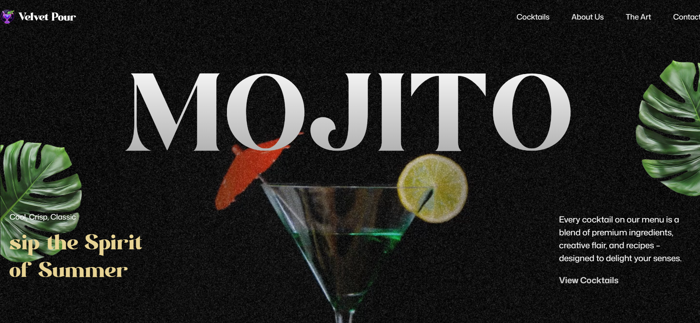

# 🍸 Velvet Pour — Cinematic Mojito Landing Page

**Live Demo:** [mojito-cocktail-eight.vercel.app](https://mojito-cocktail-eight.vercel.app)



## Overview

My first deliberate exploration of **GSAP** inside a **React** codebase — built to
move past static UI and into motion-driven storytelling. The goal wasn't "does it
work," it was "does the scroll/interaction *feel* directed, like a small
cinematic sequence, instead of a page with animations bolted on."

This project marks the starting point of a broader direction I'm building toward:
**Cinematic Experience Engineering** — websites that borrow pacing, camera
movement, and atmosphere from film, not just standard UI patterns.

## Tech Stack

- **React.js** — component architecture
- **Tailwind CSS** — utility-first styling
- **GSAP (GreenSock)** — animation timelines and scroll-triggered motion
- Fully responsive across mobile, tablet, and desktop

## What I focused on

- Sequencing animations as a **timeline**, not isolated one-off effects
- Getting comfortable with GSAP's easing and stagger to make motion feel
  intentional rather than decorative
- Keeping the React component structure clean enough that animation logic
  doesn't leak into every component

## Honest scope note

This is an early-stage exploration, not a production client project — a
deliberate first step in the GSAP/motion-design track of my learning path,
not a claim of mastery. Later projects (in progress) push further into
Three.js and scroll-driven narrative architecture.

## Run locally

```bash
git clone https://github.com/maulik-dev17/Mojito-Cocktail.git
cd Mojito-Cocktail/Mojito-Gsap
npm install
npm run dev
```

## Connect

- LinkedIn: [linkedin.com/in/maulik-prajapati-171905amd](https://www.linkedin.com/in/maulik-prajapati-171905amd/)
- GitHub: [@maulik-dev17](https://github.com/maulik-dev17)
